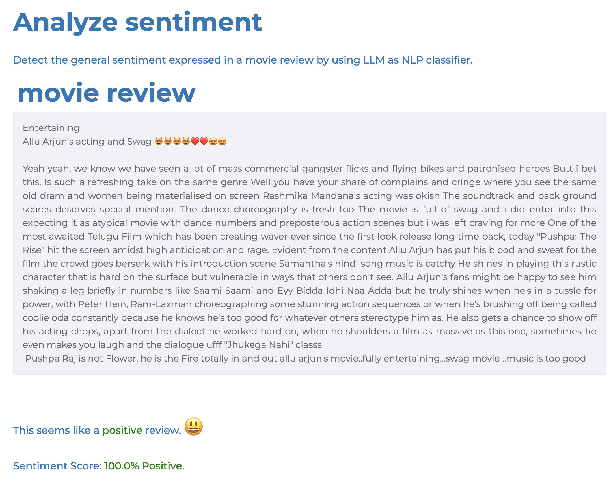

# Python Full Stack Assessment

## Objective
Develop a Python web application to detect the sentiment of movie reviews. The app should include a ReactJS-based frontend that calls a FastAPI Python backend, which utilizes a local/free LLM model for sentiment analysis. Additionally, the app must store reviews and their sentiments in an SQLite database and provide a sortable, filterable table interface to display the reviews.

## Tech Stack Requirements
- **GenAI:** Utilize a locally hosted LLM (e.g., [Ollama](https://ollama.com/) or any publicly available free LLM API.
- **Frontend:** ReactJS
- **Backend:** FastAPI (Python)
- **Database:** SQLite for review storage
- **Containerization:** Both frontend and backend must be containerized (e.g., Docker)
- **Deployment:** Deploy on a bare-metal cloud VM (e.g., GCP Compute Engine, AWS EC2)
- **Authentication:** No AuthN/AuthZ required

## Deliverables
1. **GitHub Repository:** Complete running solution uploaded to your repository.
2. **README:** A concise document explaining:
   - Implementation approach
   - Steps to run/test the application, any credentials, ip, url etc
   - Additional setup instructions (if any)

## Guidelines
- **Environment Setup:** Ensure compatibility with the latest stable library versions. Follow best coding practices.
- **Browser Compatibility:** Test with at least one major browser (e.g., Chrome, Firefox).
- **Code Quality:** Adhere to PEP8 standards for Python code.

## Notes
> **Good to Know:**
> - Use a clean, modular architecture for your code.
> - Include proper comments and documentation where necessary.

### Architecture & Sample Web Interface
Feel free to deliver your own way of this UX but make sure these two simple features are there in your app.

**App Architecture**

**Sentiment Analysis** (UI-1)

**List of Sentiment Analyzed** (UI-2)

# **Good Luck!**
